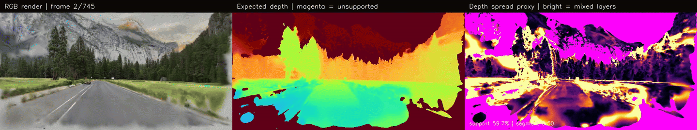
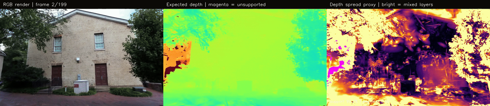

<p align="center">
  
</p>

<h1 align="center">SERVO</h1>

<p align="center">
  <strong>Simulation Engine for Real-world Vehicle Optimization</strong><br>
  Agentic simulation, validation, diagnosis, and optimization for autonomous-vehicle policies.
</p>

<p align="center">
  
  
  
  
  
</p>

SERVO is a desktop control center for building and testing autonomous-vehicle systems. It turns recorded media and simulation data into reusable worlds and scenarios, runs vehicle policies, captures synchronized evidence, diagnoses failures, creates targeted training experiences, evaluates new checkpoints, and promotes or rejects candidates through reproducible gates.

```text
observe -> diagnose -> create experience -> train -> hidden exam -> promote or reject
```

SERVO is being developed for the [All Things Agentic Hackathon](https://allthingsagentichackathon.devpost.com/) as an agentic vehicle-optimization workflow: the operator describes the goal, Servo Assistant coordinates the system, and every run produces durable evidence.

## Core product

- **Worlds** — Create, explore, organize, rename, and remove reconstructed environments.
- **Media reconstruction** — Convert overlapping images or video into Gaussian-splatting world bundles with camera recovery, optimization, checkpoints, audits, and artifact hashes.
- **Scenario execution** — Run deterministic vehicle-policy campaigns and collect synchronized observations, actions, trajectories, and outcomes.
- **Diagnosis** — Rank failure hypotheses and execute counterfactual experiments against recorded evidence.
- **Training** — Build targeted experience sets, update supported policy checkpoints, and preserve training provenance.
- **Verification** — Evaluate hidden scenarios, protect existing capabilities from regression, and promote or reject candidates.
- **Reality Debt** — Track missing evidence and turn capability gaps into explicit acquisition or training work.
- **Servo Assistant** — Use Gemini/Vertex AI or OpenAI credentials to inspect the project, navigate the application, control supported workflows, and explain results.

## System architecture

```text
media / simulator / vehicle sensors
                |
                v
        world and scenario engine
                |
                v
    policy -> trajectory -> controller
                |
                v
       synchronized run evidence
                |
                v
 Gemini diagnosis and experiment planning
                |
                v
 training -> hidden evaluation -> promotion gate
```

The desktop application is a native Qt/C++ workbench. The local RealityCI services provide durable campaign records, scenario execution, training and evaluation contracts, while the Vulkan renderer provides interactive Gaussian-world exploration and diagnostic visualization.

## What works today

- Published Gaussian worlds load in the native Vulkan viewer and retain explicit reconstruction provenance.
- The RealityCI control API and deterministic occluded-pedestrian golden campaign run locally with durable records.
- The CARLA 0.9.16 integration includes fail-closed packaged-runtime discovery, owned process/session management, inferred-corridor OpenDRIVE companions, synchronous explicit-control workers, CARLA/3DGS/hybrid observation adapters, a real three-camera DriveMA-2B policy endpoint, and native live-drive UI/controller plumbing.
- The packaged CARLA 0.9.16 runtime registered in `simulations/runtime/carla/settings.json` has passed Servo's real Town01 physics/RGB preflight and generated-OpenDRIVE displacement test. CARLA source checkouts are neither discovered nor required at runtime.
- The latest retained T5/DriveMA snow run completed 99.2% of its 30.5 m inferred corridor with zero collisions. Its evidence records 90% snow accumulation, a 9.81 m/s² CARLA gravity reference, 9.77 m/s² median measured IMU magnitude, and passing ground contact. T5 remains review-required and explicitly not collision validated because its monocular scale and off-path Gaussian geometry are not trustworthy enough for that claim.
- Servo Assistant uses the real local control plane and configured Gemini/Vertex AI or OpenAI provider to inspect durable worlds, runs, weather, logs, and evidence. Unsupported actions fail closed instead of returning simulated success.

See [local CARLA setup](docs/LOCAL_WINDOWS_CARLA_SETUP.md) and [integration architecture](docs/CARLA_INTEGRATION.md).

## Reconstruction demos

### Yosemite road

[](docs/assets/reconstruction/yosemite-road-r9-observed-path-audit.mp4)

### Gerrard Hall

[](docs/assets/reconstruction/gerrard-observed-path-audit.mp4)

Select either preview to open the full-resolution H.264 audit video.

## Media-to-world pipeline

```text
images / video
      -> frame selection and color management
      -> camera recovery and sparse geometry
      -> Gaussian optimization
      -> exported-artifact and path audit
      -> world bundle
      -> native Vulkan exploration
```

Published world bundles contain the Gaussian PLY, camera solution, reconstruction configuration, sanitized source provenance, metrics, validation media, and SHA-256 artifact hashes. Completed worlds appear automatically in the **Worlds** workspace.

The Explore view supports free look, recorded-route movement, bounded lateral and vertical motion, configurable movement speed, and Appearance, Depth, Structure, and Coverage views. Clear, rain, snow, fog, and wet-road presentation modes are available for scenario visualization. Generated or inferred weather is labeled separately from measured geometry and never upgrades a world to collision validated.

## Quick start

Start the local services and desktop application from an existing build:

```powershell
powershell.exe -NoProfile -ExecutionPolicy Bypass -File .\Start-Servo.ps1
```

Build the native desktop application:

```powershell
$env:Path = "C:\Qt\6.11.1\mingw_64\bin;C:\Qt\Tools\mingw1310_64\bin;C:\Qt\Tools\CMake_64\bin;$env:Path"

cmake -S . -B build -G Ninja `
  -DCMAKE_PREFIX_PATH=C:/Qt/6.11.1/mingw_64 `
  -DCMAKE_CXX_COMPILER=C:/Qt/Tools/mingw1310_64/bin/g++.exe
cmake --build build --parallel
.\build\appServo.exe
```

Run the test suites:

```powershell
ctest --test-dir build --output-on-failure
python -m unittest discover -s tests/python -p "test_*.py" -v
```

### Reconstruction runtime

The native Windows reconstruction worker uses Python, PyTorch CUDA, FFmpeg/ffprobe, COLMAP, and gsplat. Its setup is checksum-locked and does not require Docker or WSL.

```powershell
powershell.exe -NoProfile -ExecutionPolicy Bypass `
  -File tools\reconstruction\setup_native.ps1 `
  -Python "C:\path\to\python.exe"
```

## SERVO and its open-source foundation

SERVO owns the product workflow and integration layer: the desktop experience, world library, media policy, training policy, reconstruction orchestration, quality gates, scenario records, causal experiments, hidden evaluation, promotion system, Reality Debt, assistant integration, manifests, and Vulkan Gaussian renderer.

SERVO builds on established open-source components:

| Component | Role | License |
| --- | --- | --- |
| [Qt](https://www.qt.io/) | Native desktop UI and rendering hardware interface | Qt licensing terms |
| [COLMAP](https://github.com/colmap/colmap) / PyCOLMAP | Camera recovery and sparse geometry | BSD-3-Clause |
| [gsplat](https://github.com/nerfstudio-project/gsplat) | CUDA Gaussian rasterization and densification primitives | Apache-2.0 |
| [PyTorch](https://pytorch.org/) | Tensor, CUDA, and training runtime | BSD-style |
| [OpenCV](https://opencv.org/) | Image and vision utilities | Apache-2.0 |
| [FFmpeg](https://ffmpeg.org/) | Media inspection and decoding | Project-specific LGPL/GPL configuration |

The application code in this repository is SERVO's GPLv3 implementation. Upstream projects retain their own copyrights, licenses, model terms, and dataset terms. Pinned reconstruction versions and hashes are recorded in [`tools/reconstruction/worker-lock.json`](tools/reconstruction/worker-lock.json).

## License

SERVO is licensed under [GNU GPL v3.0 only](LICENSE). Third-party libraries, tools, models, datasets, and assets remain subject to their respective terms.
