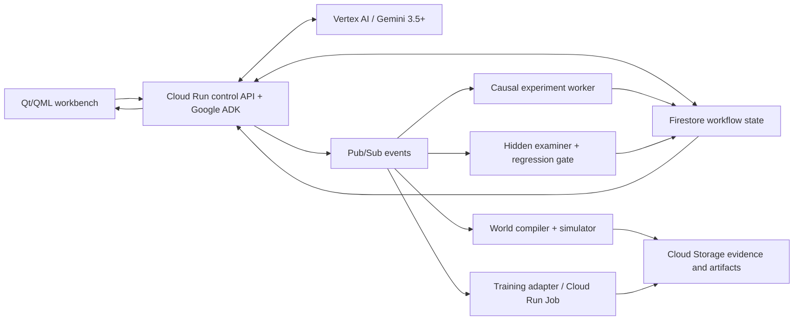

<p align="center">
  
</p>

<h1 align="center">Servo</h1>

<p align="center">
  <strong>Autonomous CI/CD for physical AI</strong><br>
  Turn policy failures into diagnosed capability gaps, targeted training, hidden exams, and evidence-backed promotion decisions.
</p>

<p align="center">
  
  
  
  
</p>

Servo is being built for the [All Things Agentic Hackathon](https://allthingsagentichackathon.devpost.com/) Taskmaster track. Give Servo a physical-AI policy, a robot or vehicle configuration, and authorized real-world recordings. The target system compiles executable worlds, runs the policy, investigates failures, creates the missing experiences, trains through a supported adapter, verifies the result on hidden scenarios, checks regressions, and promotes or rejects the checkpoint.

```text
observe -> run -> fail -> diagnose causally -> generate targeted experience
        -> train -> hidden exam -> regression gate -> promote or reject -> repeat
```

## Is Servo an AI agent?

The intended RealityCI loop is an AI agent: it accepts a long-running goal, observes run evidence, makes runtime decisions with Gemini, invokes simulation and training tools, persists state, verifies outcomes, handles failures, and continues without a person choosing every step.

The repository is not a complete RealityCI agent yet. Today it contains the production Qt workbench, a Vulkan-only hardware-rendered viewport, persistent media ingest, and a real native Windows media-to-3D-Gaussian worker. That worker hashes sources, selects video keyframes, recovers cameras with COLMAP, enforces a quantitative pose gate, trains with gsplat/CUDA, checkpoints complete optimizer state, evaluates held-out views, validates the exported PLY, and publishes a hash-addressed world bundle. Learned depth, the Vulkan splat viewer, Gemini, Google ADK, Google Cloud, simulation, causal diagnosis, policy training, and hidden exams remain to be built. Submitted now, Servo is a serious autonomous world-building foundation, not yet the hackathon's full AI agent.

## What makes the target system different

Servo is not pitched as a Gaussian-scene generator, a generic physical-AI dashboard, or a chatbot for robotics. Its unit of work is a falsifiable capability claim:

1. Detect a policy failure and preserve the complete evidence bundle.
2. Form competing causal hypotheses and choose counterfactual experiments.
3. Identify the smallest capability gap supported by the evidence.
4. Select or request the missing experience and an authorized training adapter.
5. Train a candidate checkpoint while reserving hidden evaluation worlds.
6. Require the hidden exam and the existing regression suite to pass.
7. Promote or reject the checkpoint and record the decision in Reality Debt.

Gemini acts as the research scientist controlling the workflow. Deterministic systems remain responsible for physics, metrics, backpropagation, safety limits, and promotion thresholds.

## Architecture target



The first complete vertical slice should be deliberately narrow: one compact trainable policy, one simulator path, one failure class, one real weight update, one hidden exam, and one automatic promote/reject decision. A working end-to-end loop is more valuable than many disconnected integrations.

## Hackathon proof checklist

| Requirement | Planned proof | Current status |
| --- | --- | --- |
| Gemini 3.5+ | Causal diagnosis and experiment selection through Vertex AI | Not implemented |
| Google agent framework | Durable workflow and tool orchestration with Google ADK | Not implemented |
| Google Cloud service | Cloud Run, Pub/Sub, Firestore, and Cloud Storage execution trace | Not implemented |
| Autonomous action | Failure event triggers diagnosis, training, evaluation, and checkpoint decision | Not implemented |
| State and recovery | Persisted run state, idempotent jobs, bounded retries, and resumable execution | Not implemented |
| Production evidence | Reproducible repo, architecture diagram, unedited demo, and visible Cloud logs | In progress |

## Current frontend foundation

- A **Create World** workspace that accepts multiple images, videos, dropped files, and recursively selected folders.
- Sources are referenced in place. Image headers and video metadata are probed in bounded background workers, so importing a long or multi-gigabyte video does not copy or decode the complete file.
- A versioned local source catalog with atomic writes, restart recovery, canonical-path deduplication, fixed-size sampled fingerprints, and visible missing/corrupt/unsupported-file errors.
- Compact Qt/QML desktop workbench with resizable library, viewport, inspector, and debug surfaces.
- Real Qt Quick 3D `View3D` with Vulkan forced and verified before the window is shown; camera orbit, pan, zoom, presets, grid, and renderer statistics are functional.
- Live process FPS activity, CPU, RAM, Vulkan device/type, and graphics-backend readouts with no fabricated telemetry.
- A native reconstruction controller with exact dependency and CUDA-kernel preflight, enforced storage/VRAM gates, versioned JSONL progress, detached execution that survives closing the UI, durable stage receipts, safe cancellation, retry, and verified-checkpoint resume.
- Three bounded 12 GB reconstruction profiles, including the Servo Fidelity 3DGS r3 master with antialiased rasterization, AbsGS detail recovery, coarse-to-fine optimization, bounded exposure compensation, and explicit capture/scale limitations before a job can start.
- Neutral empty states and disabled service actions until real models and backend services are attached.
- Cohesive 20 x 20 SVG action-icon system, a transparent application mark, persistent layout settings, and no forced animation loop.

**Build world** is connected to the pinned native worker and becomes available only when Vulkan, every native dependency, the real gsplat CUDA forward/backward test, storage, and at least one ready source pass preflight. The frontend never invents runs, failures, percentages, telemetry, causal confidence, reconstruction quality, exam results, or Reality Debt. See [the media-to-world production plan](docs/WORLD_RECONSTRUCTION_PLAN.md) and [the frontend contract](docs/FRONTEND.md) for the implementation and remaining boundaries.

## Four-minute demo target

The submission demo should show one uninterrupted chain:

```text
policy enters rare scenario
-> failure event and evidence bundle
-> Gemini chooses counterfactual tests
-> root cause isolated
-> ADK launches targeted training
-> checkpoint weights change
-> hidden world passes
-> old-capability regression suite passes
-> checkpoint promoted
-> Servo selects the next unproven capability
```

The recording must also show the Cloud Run deployment or URL, Pub/Sub/Firestore activity, and the repository's reproducible setup.

## Stack

| Layer | Technology |
| --- | --- |
| Desktop shell | Qt 6.11, QML, Qt Quick Controls |
| Source ingestion | Native C++ catalog; Qt Concurrent; QImageReader; FFmpeg/ffprobe |
| World viewport | Qt Quick 3D / RHI; Vulkan required and verified |
| Reconstruction worker | Native Windows Python 3.11 + CUDA 12.8 + PyTorch 2.11 + COLMAP 4.1.1 + gsplat 1.5.3 |
| Performance-critical code | C++20; CUDA for reconstruction; Vulkan for application rendering |
| Agent orchestration | Python and Google ADK, planned |
| Reasoning | Gemini 3.5+ through Vertex AI, planned |
| Durable control plane | Cloud Run, Pub/Sub, Firestore, and Cloud Storage, planned |
| Policies and training | Typed PyTorch/JAX/ONNX adapters, planned |

## Build the current desktop shell

Requirements: the exact Qt 6.11 development build used by the application, including Concurrent, GuiPrivate, Quick, Quick 3D, Quick Controls 2, Quick Dialogs 2, SVG, and Test; CMake; Ninja; a C++20 compiler; and FFmpeg/ffprobe on `PATH` for video metadata. The private QRhi device-reporting API makes the Qt patch version part of the build contract.

```powershell
$env:Path = "C:\Qt\6.11.1\mingw_64\bin;C:\Qt\Tools\mingw1310_64\bin;C:\Qt\Tools\CMake_64\bin;$env:Path"

cmake -S . -B build -G Ninja `
  -DCMAKE_PREFIX_PATH=C:/Qt/6.11.1/mingw_64 `
  -DCMAKE_CXX_COMPILER=C:/Qt/Tools/mingw1310_64/bin/g++.exe
cmake --build build --parallel
./build/appServo.exe
```

Run the native ingestion tests with:

```powershell
ctest --test-dir build --output-on-failure
python tests/python/test_reconstruction_worker.py -v
```

Set `SERVO_QML_LOG` to a writable file path when collecting Qt/QML runtime diagnostics. Set `SERVO_VULKAN_VALIDATION=1` in a development environment with the Vulkan validation layer installed to request validation and debug markers. Servo exits explicitly if Qt cannot initialize a Vulkan scene graph; it does not fall back to OpenGL, WebGL, or Direct3D.

## Build a Gaussian world on native Windows

Docker and WSL are not used. The worker runs as a detached native process so Torch, CUDA, and COLMAP cannot crash the Qt UI, and an active build continues if the window closes. The app reattaches through the durable job/event record on restart. The current tested lock is Python 3.11, PyTorch `2.11.0+cu128`, CUDA Toolkit 12.8, an existing Visual Studio C++ x64 toolchain, COLMAP 4.1.1, and gsplat 1.5.3. FFmpeg and ffprobe must be available on `PATH`.

From a PowerShell process with Python 3.11 and the pinned PyTorch CUDA runtime already installed:

```powershell
powershell.exe -NoProfile -ExecutionPolicy Bypass `
  -File tools\reconstruction\setup_native.ps1 `
  -Python "C:\path\to\python.exe"
```

The setup script downloads the checksum-locked official COLMAP CUDA build, creates a per-user environment under `%LOCALAPPDATA%\Servo\reconstruction`, builds the hash-pinned gsplat source distribution with at most two compiler jobs, and finishes only after a real CUDA rasterization and backward pass succeeds. It detects and uses an existing Visual Studio C++ toolchain; it does not install or modify Visual Studio. Pass `-InstallCudaToolkit` only when CUDA 12.8 is genuinely absent and you explicitly want that toolkit installed.

In the app, open **Create World**, add overlapping images or a mostly static video, choose a profile, and press **Build world**. Servo owns the reconstruction policy and uses gsplat as its Apache-2.0 CUDA rasterizer and densification/pruning strategy toolkit. The Fidelity profile produces anisotropic degree-three 3D Gaussians with antialiased rasterization, AbsGS detail recovery, coarse-to-fine training, bounded exposure compensation, transactional checkpoints, cleanup statistics, and a hard allocation budget. The published bundle contains `world.ply`, `world.json`, appearance parameters, pose and training metrics, source/frame provenance, COLMAP sparse data, sanitized configuration, SHA-256 hashes, and the fidelity master. Monocular scale remains unknown until a measurement anchor is supplied, and unobserved surfaces are not fabricated as reconstruction truth. The current Qt viewport does not render the published PLY yet; the native Vulkan splat renderer is the next delivery milestone.

The clean 2026-08-10 Fidelity acceptance registered all 100 source photographs, completed 40,000 native CUDA optimization steps, and atomically published 577,553 cleaned SH3 Gaussians in a 198.14 MiB, 27-artifact world bundle. It peaked at 1.664 GiB reserved VRAM on the RTX 4080 Laptop GPU. Held-out appearance scored 18.05 dB PSNR / 0.657 SSIM: a passing engineering result with coherent static architecture, but below Servo's preferred 23 dB / 0.75 tier and visibly weaker on foliage and occlusion boundaries. Servo therefore labels this artifact `review-required`, not final photorealistic quality. Exact evidence and remaining work are tracked in [the production plan](docs/WORLD_RECONSTRUCTION_PLAN.md).

## Reconstruction provenance and acceptance evidence

Servo's reconstruction is our production pipeline, but it is not a claim that we invented structure-from-motion or the underlying 3D Gaussian Splatting method.

| Layer | What Servo uses | Ownership and license boundary |
| --- | --- | --- |
| Servo application and pipeline | Qt/QML workbench, media catalog, keyframe policy, job state machine, resource gates, training loop, checkpoint/recovery contract, evaluation, cleanup, streaming export, and world manifests | Implemented in this repository; GPLv3 |
| Camera recovery | COLMAP/PyCOLMAP 4.1.1 for features, matching, calibration, poses, and sparse geometry | Upstream COLMAP; BSD-3-Clause with separately licensed dependencies |
| Gaussian optimization primitives | gsplat 1.5.3 CUDA rasterization plus `DefaultStrategy` densification/pruning operations | Upstream gsplat; Apache-2.0 |
| Tensor optimization and media handling | PyTorch, OpenCV, and an external FFmpeg/ffprobe installation | Upstream open-source projects under their respective licenses; FFmpeg is not redistributed here |
| 3DGS research basis | The published [3D Gaussian Splatting](https://repo-sam.inria.fr/fungraph/3d-gaussian-splatting/) representation and optimization ideas | Based on the paper; the [original Graphdeco source repository](https://github.com/graphdeco-inria/gaussian-splatting) is not bundled or imported because its software license is research/non-commercial |

In short: this is Servo's own end-to-end reconstruction product and reliability layer built on open-source numerical foundations. It is not a renamed copy of another reconstruction application, and it is also not a from-scratch invention of every underlying algorithm. Exact pinned versions, source hashes, and license identifiers are recorded in [`worker-lock.json`](tools/reconstruction/worker-lock.json).

### Observed-path audit

[](docs/assets/reconstruction/gerrard-observed-path-audit.mp4)

**The audit plays automatically above. Click it to open the 6.63-second H.264 version with native controls and full quality.** It renders 199 interpolated poses between the 100 registered cameras without extrapolating beyond the observed path. Mean visible splat support was 99.40% and the minimum was 97.38%, but the depth-spread proxy remained high: 11.5% at the median and 54.2% at P95. The clip is therefore movement and failure evidence, not a claim of collision-safe depth or final photorealism.

The input is the public [COLMAP Gerrard Hall example dataset](https://colmap.github.io/datasets.html). COLMAP's dataset page provides the capture for download but does not state a separate media license. The derived clip is included as attributed evaluation evidence and is not relicensed under Servo's GPL; see the [asset notice](docs/assets/reconstruction/README.md). A distribution that requires an explicit media grant should replace it with a contributor-owned capture.

## License

Servo is licensed under [GNU GPL v3.0 only](LICENSE). Qt is dual-licensed and individual modules have different open-source terms; Qt Quick 3D is offered under commercial or GPLv3 terms. This repository uses GPLv3 and does not claim that the free Qt edition removes redistribution obligations. Review Qt's [licensing overview](https://doc.qt.io/qt-6/licensing.html) before distributing binaries.
