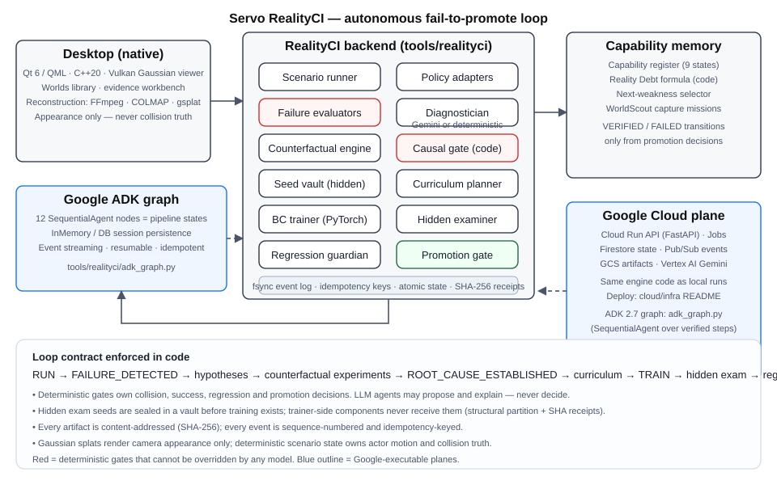

# Servo

## One-line summary

Servo is an autonomous CI/CD engine for physical AI that reconstructs test worlds, investigates driving-policy failures, trains targeted fixes, and promotes only evidence-backed model updates.

## About the project

### Inspiration

Software teams have CI/CD. A bad change is built, tested, compared with a baseline, and blocked before release. Physical AI still has a much more fragmented loop. A vehicle policy fails in a simulator or a recorded scene, someone watches the video, guesses at the cause, creates new data by hand, starts another training run, and then tries to remember whether the new checkpoint broke something else.

Servo began with a simple question: what would CI/CD look like if the thing being tested had to perceive and act in a world?

We wanted an agent that did more than discuss a failure. It needed to gather evidence, run experiments, change a model, test the result, and leave behind a record that another person could audit.

### What it does

Servo turns a physical-AI failure into a complete improvement workflow.

A user gives Servo a policy, a world, and a capability goal. Servo runs the policy and records synchronized evidence such as frames, detections, controls, trajectory, and collision events. Gemini 3.7 Flash examines that evidence and proposes competing explanations. Google ADK then routes bounded tools that run counterfactual experiments instead of accepting the first plausible answer.

Once the evidence establishes a capability gap, Servo creates a targeted curriculum, reserves hidden test seeds before training begins, trains a new PyTorch checkpoint, and evaluates it against both the hidden exam and protected regression suites. Deterministic code, not the language model, makes the final promote or reject decision.

The desktop also turns recorded media into explorable Gaussian worlds. Those worlds provide visual context and coverage diagnostics. Servo keeps reconstructed appearance separate from collision truth and clearly marks inferred or unknown geometry.

The result is a Taskmaster workflow that can move through:

`RUN → DIAGNOSE → EXPERIMENT → TRAIN → EXAM → PROMOTE OR REJECT`

without asking a person to manually guide every transition.

### How we built it

Servo is a native Windows desktop application built with Qt, QML, C++, Vulkan, and QRhi. Its world pipeline uses FFmpeg, COLMAP, PyTorch CUDA, gsplat, and a native Gaussian renderer. The policy and RealityCI services are written in Python with real PyTorch checkpoint training and content-addressed artifacts.

The agent workflow uses **Google ADK 2.7.1**. A `SequentialAgent` graph wraps the verified campaign states and a runner executes the graph with explicit session state. **Google Gen AI SDK 2.19.0** calls **Gemini 3.7 Flash** for structured diagnosis, bounded tool selection, and evidence summaries. Gemini can propose an action, but schemas, allowlists, causal gates, hidden exams, and promotion rules remain deterministic.

The Google Cloud control plane is deployed in project `servo-1f808`:

* A Firebase-authenticated API runs on Cloud Run.
* A Cloud Run Job is configured for asynchronous campaigns.
* Vertex AI provides the Gemini execution path for cloud campaigns.
* Firestore stores bounded campaign metadata, hashes, status, and `gs://` pointers.
* Cloud Storage stores large evidence bundles, Gaussian worlds, videos, and checkpoints.
* Cloud Build and Artifact Registry produce and store the deployment images.
* Cloud Logging captures service and job logs.

The public Cloud Run endpoint rejects requests without a valid Firebase bearer token. The desktop exposes authenticated cloud readiness instead of inferring success from configuration.

### Challenges we ran into

The hardest problem was preventing a persuasive explanation from becoming a false conclusion. Gemini is good at generating hypotheses, but a safety-relevant workflow cannot promote a model because an answer sounds reasonable. We built a separation between model reasoning and system authority. Gemini proposes. Tools measure. Code decides.

World reconstruction created a different challenge. A forward-facing video can produce a convincing view along the recorded path while falling apart when the camera moves into unobserved space. We spent many iterations improving reconstruction and learned to stop treating visual quality as geometric truth. Servo now exposes appearance, inferred depth, structure, coverage, and provenance separately, and it never calls Gaussian opacity collision geometry.

We also had to make training evidence difficult to game. Hidden seeds are sealed before the trainer exists, checkpoint hashes must agree across records, and a candidate must beat the baseline without exceeding protected regression limits.

Finally, cloud deployment forced us to separate small searchable state from large binary artifacts. Firestore is an index, while Cloud Storage owns the versioned bytes and hash manifests.

### Accomplishments that we're proud of

Servo is not a chatbot wrapped around a dashboard. The agent can execute an ordered campaign, inspect failures, select bounded interventions, train a checkpoint whose weights actually change, run a hidden exam, protect existing capabilities, and produce a deterministic promotion decision.

One live Ask Servo run used Gemini 3.7 Flash and Google ADK to inspect a campaign, choose the allowed `run_to_completion` action, and verify 21 ordered events and 80 artifacts. The candidate was rejected by the promotion gate. We are proud of that rejection because it proves the system does not turn every agent run into a success story.

The repository also includes a reproducible native application, a Vulkan Gaussian renderer, Firebase authentication, a deployed Cloud Run API and Job, Firestore and Cloud Storage integrations, a four-minute demo plan, an architecture diagram, and automated tests for the agent graph, Gemini boundary, cloud dispatch, training, hidden evaluation, and fail-closed decisions.

### What we learned

The most useful agent is not always the agent with the most freedom. Servo became more autonomous when each action had a clear contract, evidence requirement, and recovery path.

We also learned that appearance, physics, semantics, and evidence should be separate layers. A visually realistic world is useful, but it should not silently become a collision map. A simulator event is useful, but it should not be presented as an observation from the original camera. Clear provenance makes the product more trustworthy and easier to debug.

Our Reality Debt score captures the remaining verified capability gaps as

$$
D = \sum_i w_i(1-c_i),
$$

where \(w_i\) is the importance of a capability and \(c_i\) is its evidence-backed confidence. The exact score is computed by code, not by Gemini. This gives the autonomous loop a measurable reason to choose the next weakness.

### What's next for Servo

The immediate next step is to capture one complete authenticated cloud campaign receipt that connects Cloud Run, the campaign Job, Vertex AI, Firestore, and Cloud Storage in a single trace.

After the hackathon, we want to add more policy adapters, metric sensor-backed road geometry, richer multi-camera capture, per-object dynamic representations, and longer-running cloud campaigns. Google Sign-In can also be added as an optional operator login once its native OAuth redirect flow is configured and tested. The core principle will remain unchanged: every improvement must come with evidence strong enough to reject it when it is wrong.

## Why this matters

Physical-AI teams do not only need more synthetic data. They need a disciplined loop that identifies the right missing experience, changes the policy, proves whether the change generalizes, and prevents regressions. Servo makes that loop visible, reproducible, and increasingly autonomous.

## How we used AI

Gemini 3.7 Flash performs structured evidence analysis, generates competing causal hypotheses, chooses from a bounded Servo tool catalog, and summarizes verified outcomes. Google ADK executes the campaign graph. The model cannot directly promote a checkpoint, alter hidden seeds, or waive a failed gate.

## How we used Codex

Codex was used as an engineering collaborator across the native UI, Vulkan renderer, reconstruction pipeline, cloud deployment, test infrastructure, documentation, and debugging. Changes were compiled and tested locally, and unsupported claims were removed when the evidence did not justify them.

## Key features

* End-to-end Taskmaster workflow for physical-AI improvement
* Gemini-guided diagnosis with executed counterfactual experiments
* Google ADK campaign orchestration
* Real PyTorch checkpoint training and hash-bound artifacts
* Hidden exams reserved before training
* Deterministic promotion and regression protection
* Native video-to-Gaussian reconstruction and exploration
* Firebase-authenticated Cloud Run control plane
* Firestore metadata index and versioned Cloud Storage evidence
* Explicit observed, inferred, generated, and unknown provenance

## Architecture



`Qt/QML desktop → Firebase Auth → Cloud Run API → Cloud Run Job → Google ADK → Gemini 3.7 Flash on Vertex AI → training and verification → Firestore metadata + Cloud Storage evidence`

## Testing instructions

From an existing Windows build:

```powershell
powershell.exe -NoProfile -ExecutionPolicy Bypass -File .\Start-Servo.ps1
```

Run the RealityCI backend tests:

```powershell
py -3.11 -m venv .venv-realityci
.\.venv-realityci\Scripts\python.exe -m pip install --upgrade pip
.\.venv-realityci\Scripts\python.exe -m pip install torch==2.11.0 --index-url https://download.pytorch.org/whl/cpu
.\.venv-realityci\Scripts\python.exe -m pip install -r tools\realityci\requirements-test.txt
.\.venv-realityci\Scripts\python.exe -m pytest tests\realityci -q
```

Run the native tests:

```powershell
$env:Path = "C:\Qt\6.11.1\mingw_64\bin;C:\Qt\Tools\mingw1310_64\bin;C:\Qt\Tools\CMake_64\bin;$env:Path"
cmake --build build --parallel
ctest --test-dir build --output-on-failure
```

The complete setup, expected results, and cloud deployment path are documented in the repository README and `cloud/infra/README.md`.

## Public repository link

https://github.com/meowshmalloww/Servo

## Public demo link

Desktop application. No public web frontend is claimed. The authenticated API deployment is shown as cloud infrastructure evidence, not as a public product UI.

## Demo video

TODO: add the final public YouTube or Vimeo URL. The official submission requires a video.

## Screenshot shot list

1. Ask Servo starting a bounded campaign
2. Failure evidence and competing causal hypotheses
3. Training candidate with distinct checkpoint hash
4. Hidden exam and deterministic promotion gate
5. Google Cloud Run revision, Job, and logs
6. Reconstructed world with diagnostic and provenance views

## Official form answers

* Submitter type: Individual
* Organization name: Not applicable, individual submission
* Category: Taskmaster
* Repository: https://github.com/meowshmalloww/Servo
* Reproducible testing instructions in README: Yes
* Google SDK: Agent Development Kit (ADK)
* Google Cloud service: Cloud Run
* Google AI models: Gemini 3.7 Flash through Vertex AI and the Google Gen AI SDK

## Known limitations

* The deployed API and campaign Job are proven as infrastructure, but a complete authenticated cloud campaign receipt is still pending.
* The Gaussian road world is visual and nonmetric. It is not collision validated and does not provide complete 360-degree measured coverage.
* Native simulator evidence and Gaussian appearance are separate truth layers, not one unified physical scene.
* Google Sign-In is not implemented. Current operator access uses Firebase Email/Password.
* The final public demo video URL is still missing.

## Submission readiness notes

The Devpost project exists as draft `servo-nabf1x`. The account is registered for All Things Agentic Hackathon. The project description and video have not yet been published to Devpost.

## TODO official form fields

* Confirm country of residence.
* Confirm the project start date in `MM-DD-YY` format.
* Upload the architecture diagram file.
* Record and add the required public demo video.
* Decide whether to add optional public content and social links.
