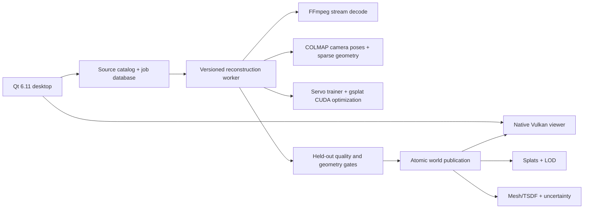

# Servo media-to-world production plan

Status: Servo Fidelity 3DGS r3 implemented and clean full-capture native acceptance completed; appearance quality is review-required and Vulkan splat rendering remains, 2026-08-10.

This document defines Servo's first product foundation: turn ordinary, unposed images and monocular video into a locally stored 3D Gaussian scene that can later support robotics-world compilation. It deliberately separates what the source media proves from what a generative model may only hypothesize.

## Decision

Build one narrow, auditable pipeline before the agent, training, diagnosis, or simulation features:

```text
source media
  -> durable registration and metadata probe
  -> adaptive keyframes
  -> camera poses, sparse geometry, confidence gates, and scale evidence
  -> incremental Gaussian optimization
  -> validation and artifact cleanup
  -> immutable world publication
  -> native Vulkan viewing
```

The reconstruction worker uses CUDA/PyTorch because the maintained differentiable Gaussian and vision-model ecosystem is CUDA-based. The desktop application and final splat viewer use Vulkan only. Vulkan is not a substitute for PyTorch/CUDA training kernels.

The implemented baseline is native Windows only--no Docker or WSL. It uses a separately versioned Python process, CUDA 12.8, PyTorch 2.11, COLMAP/PyCOLMAP 4.1.1, and a hash-pinned native build of gsplat 1.5.3. Servo owns the media, pose, optimization policy, resource limits, checkpoints, validation, cleanup, and publication contracts; gsplat supplies the Apache-2.0 CUDA rasterizer and `DefaultStrategy` densification/pruning operations. The r3 fidelity master is anisotropic 3D Gaussians with degree-three spherical harmonics, antialiased rasterization, AbsGS absolute-gradient detail recovery, coarse-to-fine training, bounded per-frame exposure/white-balance nuisance parameters, and a hard Gaussian allocation cap. It already supports durable hash, extraction, pose, train, validate, and publish receipts; complete safe checkpoints; held-out PSNR/SSIM and visual comparisons; strict streaming PLY validation; detached app-lifecycle-safe execution; cancellation; retry; and resume. Learned depth, geometry/uncertainty layers, and the Vulkan PLY renderer are later milestones.

### 2026-08-10 Fidelity acceptance

The clean `gerrard-fidelity-r3` run used 100 unposed full-resolution photographs on the existing RTX 4080 Laptop GPU. Both incremental and calibrated global SfM completed; the gated global solution registered 100/100 images with 50,817 sparse points, 0.668 px mean and 1.416 px p95 reprojection error. Fidelity optimization ran all 40,000 steps, used full resolution for 36,000 of them, stabilized at 609,902 Gaussians after densification, and peaked at 1.664 GiB reserved CUDA memory. Transactional cleanup removed 32,349 transparent or needle candidates and published 577,553 degree-three Gaussians.

The immutable world contains 27 hashed artifacts (198.14 MiB total, including a 129.99 MiB streaming binary PLY), sanitized provenance, cameras and normalization transforms, exact runtime/configuration identity, and all 12 held-out target/render comparisons. Structural and artifact gates passed, but held-out appearance measured 18.05 dB mean PSNR and 0.657 mean SSIM. That clears the deliberately permissive engineering floor, not the preferred 23 dB / 0.75 tier, so the artifact is correctly labeled `review-required`. Visual review finds coherent building geometry and readable architectural detail, with remaining foliage blur/floaters, softened ground, and sky/occlusion-boundary artifacts. This is evidence that the native pipeline is real and durable; it is not evidence that arbitrary media has reached final best-in-class quality.

Servo keeps two independently versioned world products:

1. **Appearance:** 3D Gaussians for photorealistic novel-view rendering.
2. **Geometry:** a mesh/TSDF, scale evidence, uncertainty, and a validated navigation envelope for collision, ray queries, and robotics use.

A visually convincing splat is never treated as metric or collision truth.

## Product truths

- The application accepts source resolution, frame rate, duration, and file size without an artificial UI cap. Processing remains bounded through streaming, keyframes, chunks, levels of detail, disk preflight, and resumable stages.
- An arbitrary monocular video has no guaranteed absolute scale. Dependable centimetre or millimetre accuracy needs at least one scale anchor: a known dimension, marker, measured camera height, calibrated baseline, odometry/IMU, GPS, or later LiDAR.
- An unseen surface cannot be reconstructed as observed fact. Optional completion must be a separate `generated` layer and must not silently enter collision, safety, or metric evaluation.
- A gap-free result is a quality claim only inside the validated observation envelope. Outside it, the viewer must expose uncertainty instead of hiding it.
- Standard 3D Gaussian appearance contains captured lighting. It is not natively a physically correct ray-traced or relightable scene. Relighting and ray queries require recovered geometry, normals, materials, illumination, and explicit validation.
- The first supported capture class is a mostly static scene with useful parallax. Dynamic objects, rolling shutter, severe motion blur, water, sky, mirrors, and exposure shifts require masks or specialized handling.

These constraints follow directly from the problem formulation in [LongSplat](https://openaccess.thecvf.com/content/ICCV2025/html/Lin_LongSplat_Robust_Unposed_3D_Gaussian_Splatting_for_Casual_Long_Videos_ICCV_2025_paper.html), the geometric role of [2D Gaussian Splatting](https://surfsplatting.github.io/), and the inverse-rendering limitations documented by [GS-IR](https://openaccess.thecvf.com/content/CVPR2024/html/Liang_GS-IR_3D_Gaussian_Splatting_for_Inverse_Rendering_CVPR_2024_paper.html).

## Architecture



The native application must not import Python, Torch, CUDA, or COLMAP into its process. It launches a separately versioned worker, consumes structured events, and owns durable job state. A worker crash must not take down the UI or corrupt the last verified artifact.

On Windows, the production baseline is a per-user native runtime under `%LOCALAPPDATA%\Servo\reconstruction`. The app launches it as a detached process with an exact compiler/CUDA environment and never imports Python or CUDA in-process. A durable active-job record and append-only event log let the UI close and later reattach without terminating training. The worker writes attempt outputs first, validates and hashes them, then atomically publishes the canonical world directory. The gsplat extension is built during explicit setup rather than during a reconstruction job.

## Stage contracts

Every stage writes an atomic receipt containing input hashes, configuration hash, tool versions, start/end timestamps, outcome, metrics, log path, and artifact hashes. A stage is reusable only when its receipt and every declared artifact validate.

### 1. Register sources

- Reference originals in place; never duplicate a large source merely to add it.
- Persist canonical path, stable asset ID, file size, modification time, sampled content fingerprint, and probe result.
- Use `ffprobe` JSON for video streams, duration, average and nominal frame rate, resolution, codec, pixel/color metadata, rotation, and timestamps.
- Read only image headers during registration.
- Probe in bounded background workers. A corrupt or unsupported file becomes a visible per-item error; it does not abort other imports.
- Recursively scan explicitly selected folders and deduplicate canonical paths.
- Preserve variable-frame-rate presentation timestamps during later extraction.

The metadata boundary follows the machine-readable output supported by [ffprobe](https://ffmpeg.org/ffprobe-all.html).

### 2. Preflight resources

Before creating derived data, record and validate:

- free storage in the worker and publication locations;
- NVIDIA device, driver, CUDA runtime, compute capability, total/free VRAM;
- exact FFmpeg, COLMAP, Python, PyTorch, CUDA, and gsplat versions;
- source readability and fingerprint stability;
- expected temporary-data range and chosen eviction policy.

There is no silent quality degradation. If a lower resolution, smaller Gaussian cap, or shorter optimization window is needed, the selected profile and reason are recorded in the job.

### 3. Plan and extract frames

- Stream-decode; do not expand a whole video to frames up front.
- Preserve source ID, frame index, presentation timestamp, rotation, and decode settings in every frame record.
- Select keyframes using blur, parallax/flow, feature coverage, overlap, scene cuts, and exposure changes. Input FPS is evidence density, not a target training FPS.
- Split or recalibrate when focal length or camera model changes.
- Keep overlapping temporal windows so loop closure and global alignment remain possible.
- Derived frames are evictable and reproducible from the immutable source plus extraction receipt.

### 4. Recover cameras, sparse geometry, and scale evidence

The first stable baseline is COLMAP sequential structure-from-motion with shared intrinsics when the capture supports that assumption. Gate it on registered-frame ratio, connected components, track length, reprojection error, and camera-path sanity before Gaussian training. COLMAP is BSD-licensed and supports ordered and unordered image collections: [COLMAP](https://github.com/colmap/colmap).

For difficult casual footage, add a windowed depth/pose prior rather than replacing geometric verification. The intended 12 GB research path is:

- small overlapping pose/depth windows;
- confidence-aware Sim(3) alignment;
- loop closure and global bundle adjustment;
- learned depth used as a prior, never as unquestioned metric truth.

[Depth Anything 3](https://github.com/ByteDance-Seed/Depth-Anything-3) is the leading candidate for the streaming prior where its selected weight license permits distribution. LongSplat is the closest architectural match for casual long video, but its repository inherits research/noncommercial restrictions and is an architecture reference, not a directly copied product dependency: [LongSplat repository](https://github.com/NVlabs/LongSplat).

### 5. Optimize the Gaussian scene

The worker uses Servo's checkpointable trainer initialized by confidence-filtered COLMAP sparse points and the maintained Apache-2.0 gsplat rasterizer and `DefaultStrategy` operations. Keeping the optimization and artifact policy owned avoids importing Nerfstudio's unrelated server/viewer stack while preserving validated CUDA and densification primitives: [gsplat](https://github.com/nerfstudio-project/gsplat).

The production appearance representation is `servo-fidelity-3dgs-v1`:

- anisotropic 3D Gaussians with degree-three spherical harmonics;
- Mip-Splatting-style antialiased rasterization for stable zoom and resolution changes;
- AbsGS absolute projected gradients with its calibrated growth threshold for finer structure;
- a coarse-to-full-resolution schedule with exact camera-intrinsic scaling;
- bounded per-frame log-gain and color-bias nuisance parameters used only during optimization, while the exported world remains canonical;
- deterministic Gaussian and VRAM limits, transactional checkpoints, cleanup statistics, and a streaming binary PLY fidelity master.

3DGS MCMC remains an experimental policy because its stochastic relocation and growth path needs a separately proven deterministic memory budget on the 12 GB target. 2D Gaussian Splatting is reserved for the independently validated geometry and surface layer; replacing the appearance master with it would mix two different product claims. 3DGUT becomes relevant when Servo retains raw fisheye distortion, rolling shutter, or secondary-ray cameras instead of the current undistorted pinhole training set.

For the RTX 4080 Laptop GPU with 12 GB VRAM:

- batch size one with antialiased rasterization is the production baseline; a profile that consumes the complete 12 GB is not a safe default;
- target a measured training peak at or below the declared profile budget: Balanced is capped at 10.5 GiB and Fidelity at 11.0 GiB;
- use bounded Gaussian growth, scene-relative scale and anisotropy cleanup, and multiresolution training;
- optimize geometry at moderate resolution before tiled/high-resolution appearance refinement;
- keep inactive spatial chunks, source frames, features, and depth maps in RAM or on disk;
- checkpoint the complete trainer state, not only exported splat parameters;
- on CUDA out-of-memory, preserve diagnostics and allow one policy-controlled retry with an explicitly recorded lower resource profile.

Long-video improvement after the stable baseline adopts the transferable parts of LongSplat: incremental pose/scene optimization, visibility-local work sets, depth-aligned initialization, occlusion-aware addition of newly observed regions, periodic global refinement, and adaptive spatial anchors.

### 6. Remove artifacts and validate

Required defenses against floaters, needles, gaps, and view popping:

- dynamic/sky/water/reflection masks;
- robust photometric loss and per-frame exposure/color compensation;
- confidence-weighted depth and reprojection losses;
- scale and anisotropy limits, followed by effective-rank evaluation;
- multi-view depth, normal, visibility, and reprojection consistency;
- low-opacity, low-support, isolated-outlier pruning only after held-out validation;
- antialiased rendering and multiscale tests.

[Mip-Splatting](https://openaccess.thecvf.com/content/CVPR2024/html/Yu_Mip-Splatting_Alias-free_3D_Gaussian_Splatting_CVPR_2024_paper.html) addresses zoom/sampling artifacts. [PUP 3D-GS](https://openaccess.thecvf.com/content/CVPR2025/html/Hanson_PUP_3D-GS_Principled_Uncertainty_Pruning_for_3D_Gaussian_Splatting_CVPR_2025_paper.html) motivates sensitivity-based post-training pruning, while [Compressed 3DGS](https://openaccess.thecvf.com/content/CVPR2024/html/Niedermayr_Compressed_3D_Gaussian_Splatting_for_Accelerated_Novel_View_Synthesis_CVPR_2024_paper.html) motivates a separate compressed delivery artifact. Neither optimization is allowed to replace the fidelity master before quality comparison.

The implemented validation uses held-out temporal blocks or isolated still-image samples and records PSNR, SSIM, visual comparisons for every held-out view, reprojection errors, registered-frame coverage, appearance bounds, Gaussian cleanup and outlier statistics, artifact size, configuration identity, and peak VRAM. LPIPS, depth consistency, system RAM, Vulkan render performance, and a continuous visual sweep through the supported camera envelope remain acceptance extensions.

### 7. Publish and render

A world is published by atomic rename only after:

- its schema and every artifact parse successfully;
- hashes match the stage receipt;
- the fidelity splat renders through Servo's actual Vulkan viewer;
- geometry and uncertainty artifacts load independently;
- the validated camera envelope is present;
- provenance classifies content as `observed`, `interpolated`, or `generated`.

The fidelity master remains available. LOD/pruned/compressed derivatives point back to it and record their measured quality delta.

## Durable job schema

The control-plane contract is a versioned `job.json`, not console text:

```json
{
  "schema": "servo.reconstruction-job/v1",
  "jobId": "uuid",
  "state": "queued|running|paused|failed|cancelled|ready",
  "stage": "probe|extract|pose|depth|optimize|validate|publish",
  "sourceManifest": "sources.json",
  "sourceManifestHash": "sha256:...",
  "configurationHash": "sha256:...",
  "workerLock": "worker-lock.json",
  "completedStageReceipts": [],
  "activeCheckpoint": null,
  "lastKnownGoodCheckpoint": null,
  "metrics": {},
  "artifacts": [],
  "error": null
}
```

Worker events use JSON Lines with schema, job ID, monotonic sequence, timestamp, stage, event type, measured progress when available, and a receipt/artifact reference. The UI never invents a percentage for an operation whose denominator is unknown.

## Vulkan application contract

- Call `QQuickWindow::setGraphicsApi(QSGRendererInterface::Vulkan)` before creating a window.
- Select the discrete Vulkan physical device when available, and record the chosen device.
- Verify the actual scene-graph API after initialization. Vulkan failure is explicit; there is no OpenGL, WebGL, or Direct3D fallback.
- Keep Qt Quick UI and the future splat renderer on the same Vulkan/QRhi device.
- Use Qt's automatic Vulkan pipeline cache and add a versioned application cache after the splat pipelines exist.
- Implement the splat renderer as native C++/QRhi or a native Vulkan render node. Never create millions of QML objects or JavaScript-array splats.
- Add direct CUDA-Vulkan interop only after the file boundary is stable and separately tested. It is not required for the first production slice.

Qt documents the early Vulkan selection and failure behavior in its [scene-graph renderer documentation](https://doc.qt.io/qt-6/qtquick-visualcanvas-scenegraph-renderer.html). `QQuickRhiItem` is the likely future viewport boundary, with the explicit caveat that QRhi private APIs have limited compatibility guarantees: [QQuickRhiItem](https://doc.qt.io/qt-6/qquickrhiitem.html).

## UI and UX required for the first feature

### Source loading

- A large drop target for files and folders.
- Multi-file and recursive folder selection.
- Clear statement that originals stay in place and are not copied on import.
- One row per source with real status: queued, probing, ready, missing, unsupported, or error.
- Resolution, average FPS, duration, codec, size, and full path from the real probe.
- Retry failed probe and remove catalog reference actions. Removal never deletes source media.
- Source count, ready/error count, aggregate original size, and catalog location.
- Visible folder-scan activity with no fake percentage.

### Build setup

- Output/workspace location and free-space estimate.
- Quality/resource profile with its expected VRAM and derived-data range.
- Capture warnings for blur, insufficient parallax, dynamic content, variable intrinsics, and missing scale anchor.
- Real dependency readiness for Vulkan, NVIDIA/CUDA, FFmpeg, COLMAP, and the pinned worker.
- Build, cancel, resume, and retry actions governed by the durable job state.

### Progress and review

- Stage timeline with measured counts and stage receipts.
- Live log links, last checkpoint, resource usage, and failure reason.
- Pose/coverage inspection before expensive optimization.
- Held-out reconstruction metrics and visual compare before publication.
- Uncertainty and observation-envelope overlays in the Vulkan viewer.

## Milestones

### M1 — Native ingest and Vulkan enforcement

- Vulkan-only startup with explicit runtime verification.
- Persistent, in-place image/video source catalog.
- Background image-header/ffprobe metadata and sampled fingerprints.
- Multi-file, folder, and drag/drop UX with real errors and aggregate size.
- Documentation and automated model/probe tests.

Exit gate: a multi-gigabyte video can be registered without copying it or growing app memory with source size; restart restores the catalog; Vulkan is the measured active backend.

### M2 — Reproducible worker and frame planner

- Pinned native Windows worker environment and dependency lock.
- Preflight, storage estimate, streaming decode, adaptive keyframes, timestamps, receipts, cancel/resume.

Exit gate: variable-frame-rate, rotated, 4K/8K, Unicode-path, corrupt, and truncated inputs produce deterministic frames or explicit recoverable errors.

### M3 — Camera and geometry gate

- COLMAP sequential SfM, optional licensed matcher fallback, pose/depth confidence, scale-anchor UI, quality gate, and inspection view.

Exit gate: disconnected or low-quality reconstructions cannot proceed silently; a passing dataset has reproducible cameras and quantitative evidence.

### M4 — Fidelity Gaussian baseline

- Pinned gsplat training, complete checkpoints, bounded 12 GB profiles, held-out evaluation, fidelity PLY, and artifact publication.

Exit gate: crash/restart and OOM recovery pass; the exported splat parses and renders in the actual Vulkan viewer; quality and resource baselines are stored.

### M5 — Casual long-video quality

- Windowed depth/pose priors, loop closure, incremental spatial optimization, visibility-aware additions, artifact controls, and uncertainty.

Exit gate: locked casual-video datasets improve over M4 without violating the 12 GB target or regressing restart correctness.

### M6 — Geometry, LOD, and delivery

- Mesh/TSDF publication, validated robotics envelope, pruning, multiscale LOD, compressed derivative, and streamed Vulkan scene chunks.

Exit gate: collision/ray queries never use generated content; LOD transitions meet visual and frame-time thresholds; every derivative is traceable to the fidelity master.

### Deferred

- 4D/dynamic reconstruction.
- Generative unseen-surface completion.
- Inverse rendering, material editing, and physically based relighting.
- Direct CUDA-Vulkan sharing.
- Cloud execution and storage.

These are separate products or quality layers, not shortcuts around the validated 3D baseline.

## Acceptance matrix

| Area | Required test |
| --- | --- |
| Ingest | Constant/variable FPS, rotation, 4K/8K, long duration, Unicode and long paths, corrupt/truncated files, missing source after restart |
| Persistence | Atomic manifest writes, app kill during save, duplicate import, moved/modified source, schema migration |
| Resources | Disk-full preflight/runtime, peak RAM/VRAM, bounded probe concurrency, CUDA OOM retry policy |
| Reconstruction | Registered-frame ratio, connectivity, reprojection error, held-out PSNR/SSIM/LPIPS, depth consistency |
| Artifacts | Floaters, spikes/needles, holes, popping, zoom aliasing, path outside validated envelope |
| Recovery | Cancel and terminate during every stage, checkpoint corruption, worker restart, idempotent rerun |
| Renderer | Vulkan required, discrete-device record, resize/minimize/device-loss handling, real splat parse/render/hash |
| Release | Dependency lock, checksums, model-weight license, FFmpeg build flags, SBOM, third-party notices |

## Dependency and license policy

Ship only dependencies and weights whose terms fit the intended distribution:

| Candidate | Policy |
| --- | --- |
| Nerfstudio | Apache-2.0; algorithm and interoperability reference, not a runtime dependency |
| gsplat | Apache-2.0; maintained Gaussian CUDA backend |
| COLMAP | BSD-3-Clause; initial SfM backend |
| FFmpeg | Pin a known build/configuration; audit LGPL/GPL/nonfree flags before redistribution |
| LongSplat | Architecture reference unless separately licensed; inherited research/noncommercial terms |
| Original Graphdeco 3DGS | Do not copy into the product under its noncommercial research license |
| 2DGS/PGSR research repos | Evaluate method and exact dependency/weight licenses separately before product use |
| Generative completion models | Separate license, provenance, and safety review; never default robotics truth |

The stable baseline must be version-locked as one tested environment. Newer COLMAP, Nerfstudio, gsplat, Torch, or CUDA components enter through a repeatable benchmark and migration, not an unreviewed package upgrade.
